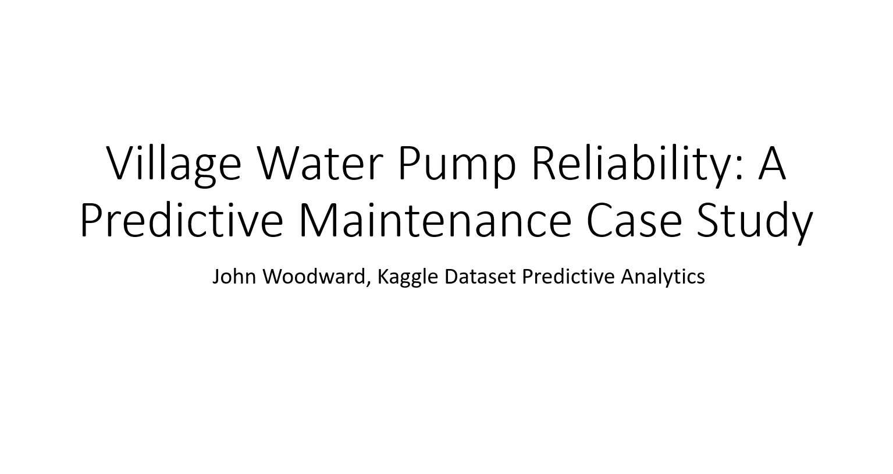
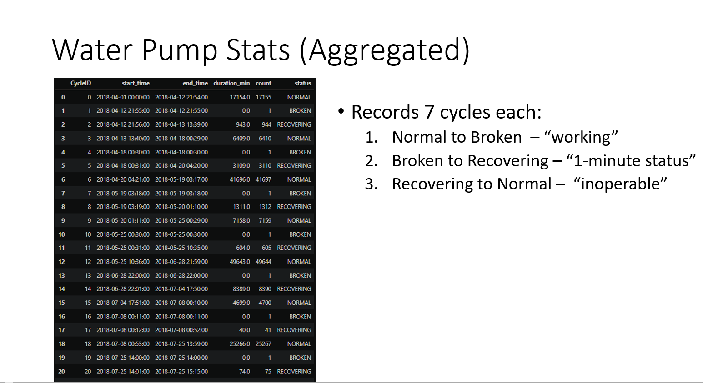
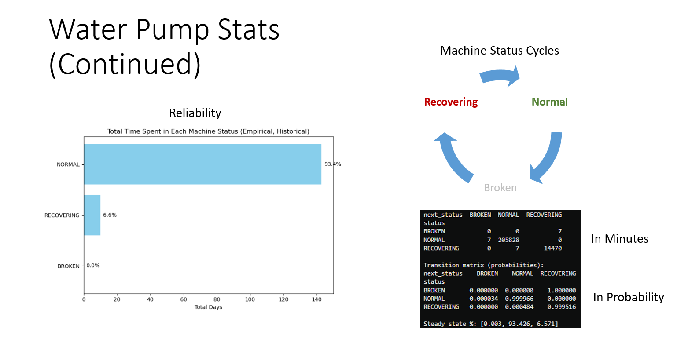
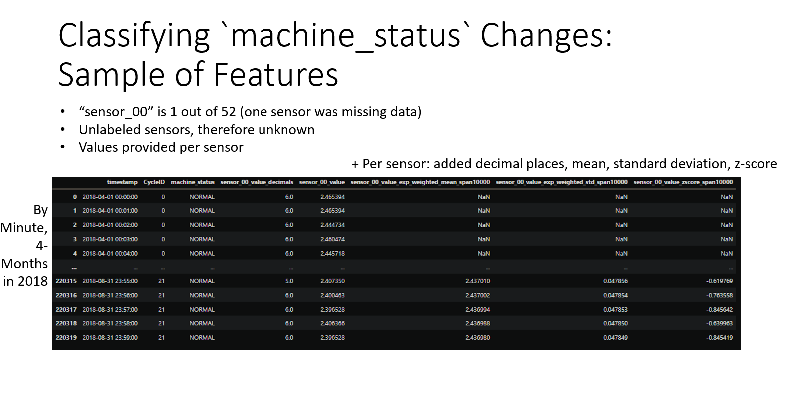
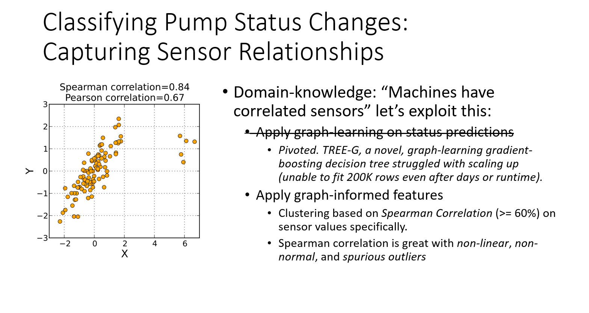

# Village Water Pump Reliability: A Predictive Maintenance Case Study

Modern machines generate massive data from constantly reporting sensors, demanding modern solutions.

This project uses a Kaggle dataset to explore hidden patterns in sensor data from a single water pump, aiming to aid in predicting what matters and what doesn't, and forecast accurately to reduce the anxiety of future downtimes or uptimes.

Curious how subtle machine signals can be turned into predictions? Let’s dive in.
- `PredictiveMaintenance.ipynb` - contains all the work.
  - `/TREE-G_Exploration` - extract this folder into the main directory to try TREE-G. It was folded here to keep things tidy. 
- `Report.pptx` - slides shown below for convenience (but the PPT is in higher resolution).

----

## Slides

